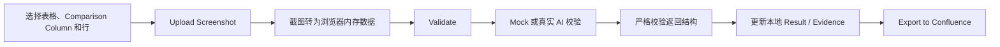

# CopyTest：Upload Screenshot 与 Validate 功能说明

## 功能概览

`Upload Screenshot` 和 `Validate` 组成 CopyTest 的截图校验链路，但两者职责不同：

- `Upload Screenshot` 负责在浏览器本地选择、校验和准备截图。这个阶段不会把文件上传到后端。
- `Validate` 负责使用当前截图核对用户选中的 Confluence 文案行，并把结果写入浏览器中的表格工作副本。这个阶段也不会更新 Confluence；只有后续点击 `Export to Confluence` 才会真正回写 Storage 和附件。



## Upload Screenshot

### 入口条件

选择 `Comparison Column` 后，页面会显示 `Upload Screenshot` 按钮。按钮只有同时满足以下条件时才可用：

- 已选择一张有效表格。
- 已选择 `Comparison Column`。
- 至少勾选了一个文案非空的逻辑行组。
- 当前没有正在进行的截图预处理、AI 校验或 Confluence 导出。

带 `rowspan` 的来源单元格会被当作一个不可拆分的逻辑行组；空文案行不能参与校验。

### 弹窗提供的操作

点击按钮后会打开同名弹窗，用户可以：

- 一次选择多张图片。
- 查看已选图片的缩略图、文件名和大小。
- 查看当前图片数量及总大小。
- 按单张图片移除待校验文件。
- 继续追加选择图片。
- 点击 `Validate` 发起校验。

关闭上传弹窗只会隐藏弹窗，不会清空已经准备好的图片，用户可以重新打开后继续操作。

### 文件限制

当前实现使用以下限制：

- 只接受 MIME 类型为 `image/*`，或文件名具有常见图片扩展名的文件。
- 最多 50 张图片。
- 所有原始文件的总大小最多 10 MB。
- 没有单文件大小、图片像素或分辨率限制。

不满足限制时，页面会显示 warning，并保留原有图片列表。

### 浏览器内的预处理

文件通过限制检查后会依次进行以下处理：

1. 使用 `FileReader` 转换为 Base64 Data URL，供预览和校验请求使用。
2. 计算文件 MD5，并按文件内容去重；内容相同的截图只保留第一次出现的文件。
3. 在原文件名中追加 UUID，同时保留扩展名，避免后续作为 Confluence 附件时发生重名。
4. 将 Base64、MD5、原始大小和新文件名保存在组件内存中。

因此，这里的“Upload”实质上是准备校验输入。文件直到 `Export to Confluence` 时，才会作为实际被 Evidence 引用的附件发送到后端。

### 图片状态何时清空

以下操作会清空待校验图片：

- Validate 成功。
- 切换到另一张 Confluence 表格。
- 成功重新导入 Confluence 页面。
- 关闭 CopyTest 主弹窗。

仅关闭上传弹窗不会清空图片；切换 `Comparison Column` 也不会自动清空，因此切换列后应确认当前截图仍适用于新列。

## Validate

### 按钮启用条件

`Validate` 只有在 `Upload Screenshot` 的入口条件仍然成立，并且内存中至少存在一张截图时才可点击。点击后还会再次检查：

- 当前截图没有超过 50 张和 10 MB 限制。
- 当前表格、Comparison Column 和表头仍然存在。
- 当前至少有一个文案非空的选中逻辑行组。

任一条件不满足时不会发起校验，并会显示相应提示。

### 校验输入

每次 Validate 会冻结当次操作所需的上下文，避免异步处理过程中读取到变化后的选择。校验输入包括：

- `targetColumnName`：当前 Comparison Column 的原始表头。
- `selectedRows`：按表格顺序排列的选中逻辑行，每项包含稳定的 `rowIndex` 和期望文案 `expectedText`。
- `uploadedScreenshots`：本次允许结果引用的截图文件名。
- 图片内容：所有截图的 Base64 Data URL。

提示词要求每个选中行独立判断，并检查全部上传截图。一张截图可以支持多行，一行也可以引用多张截图；只允许返回真正与该行有关的 Evidence。

### 当前 Mock 状态

当前代码中的 `COPY_TEST_AI_CHAT_MOCK_ENABLED` 为 `true`，所以 Validate 暂时不会真正识别截图，而是等待约 300 ms 后生成随机结果：

- 每行随机选择 0～2 张不重复的 Evidence。
- 只有选到 Evidence 时才可能通过。
- 有 Evidence 时约有 65% 的概率生成 Passed。
- Failed 的问题说明从预设文案中随机选择。

Mock 和真实 AI 使用同一请求及返回结构。将该开关改为 `false` 后，流程会调用配置为 `gpt-5.4` 的 `aiChat` 多模态接口；当前没有“真实请求失败后自动降级到 Mock”的逻辑。

### 返回结果契约

无论结果来自 Mock 还是真实 AI，前端都会执行严格校验。响应必须是一个原始 JSON 对象，根节点只能包含 `results`：

```json
{
  "results": [
    {
      "rowIndex": 0,
      "passed": true,
      "evidenceImageFileNames": ["login-example-uuid.png"],
      "languageIssues": []
    }
  ]
}
```

每项结果只能包含以下字段：

- `rowIndex`：必须与请求行号一致。
- `passed`：当前期望文案是否被截图可靠支持。
- `evidenceImageFileNames`：真正相关的截图文件名，只能引用本次上传图片。
- `languageIssues`：校验失败的原因。

前端还会验证以下语义：

- 结果数量、顺序和 `rowIndex` 必须与请求完全一致，不能缺行、增行或重复。
- 字符串数组不能包含空白项或重复项。
- Passed 必须至少包含一张 Evidence，且 `languageIssues` 必须为空。
- Failed 必须包含至少一条 `languageIssues`，Evidence 可以为空。
- 不允许出现额外字段、Markdown 代码块或解释文字。

任何结构或语义不合法都会使整次 Validate 失败，不会把部分结果写入表格。

### 结果如何写入表格

结果通过校验后，前端会将返回的文件名绑定到本次内存图片，并更新当前表格工作副本：

- 为当前 Comparison Column 创建或复用 `Test Result - <列名>` 和 `Test Evidence - <列名>`。
- Result 显示绿色 `Passed:` 或红色 `Failed:`。
- Failed 会在对应 Screen 下展示 `languageIssues`。
- Evidence 按上传顺序去重并编号为 `Screen01`、`Screen02` 等。
- 物理连续且共享截图的逻辑行组可以合并 Evidence，但每行 Result 只引用该行实际命中的 Screen。
- 只替换 CopyTest 标记的受管内容，保留单元格内的人工内容。
- 将当前表格和来源列组成的 pair 标记为“待导出”。

如果某行结果没有可绑定的 Evidence，该行不会保留可见的 Result/Evidence；已有的 CopyTest 受管内容也会被清理。

### 成功与失败后的界面状态

Validate 成功后：

- 关闭上传弹窗。
- 清空待校验图片。
- 在表格预览中显示新的 Result/Evidence。
- 显示 `Copy test validation completed` 成功提示。
- 允许用户通过 `Export to Confluence` 回写当前 pair。

Validate 失败后：

- 显示 `Copy test validation failed`。
- 保留上传弹窗和当前截图，方便修改或重试。
- 不提交本次不完整结果。

校验期间，行选择、Evidence 删除和相关关闭操作会被禁用，避免工作表状态与异步结果交错。

## 两个按钮的核心区别

| 操作 | 主要职责 | 是否请求 AI | 是否上传附件 | 是否修改本地表格 | 是否更新 Confluence |
| --- | --- | --- | --- | --- | --- |
| `Upload Screenshot` | 选择、检查、去重并缓存截图 | 否 | 否 | 否 | 否 |
| `Validate` | 校验选中文案并生成 Result/Evidence | 设计上是；当前不请求真实 AI，走随机 Mock | 否 | 是 | 否 |
| `Export to Confluence` | 回写当前 pair 和实际引用附件 | 否 | 是 | 提交本地基线 | 是 |

## 关键实现文件

以下路径均相对于 `vite-project-react18/src/pages/home/components/copyTest/`：

- `components/CopyTestSelectors.tsx`：Upload Screenshot 入口按钮。
- `components/UploadScreenshotModal.tsx`：图片列表、限制摘要和 Validate 按钮。
- `hooks/useCopyTestUpload.ts`：待校验图片状态及预处理流程。
- `utils/uploadUtils.ts`：文件检查、Base64 转换、MD5 去重和 UUID 命名。
- `utils/copyTestActionState.ts`：Upload Screenshot 与 Validate 的启用条件。
- `utils/copyTestControllerUtils.ts`：Validate 前置检查和上下文构建。
- `hooks/useCopyTestController.ts`：两个功能的主流程与成功、失败处理。
- `api/copyTestApi.ts`：AI 请求构建和严格结果解析。
- `prompt/copyTestValidationPrompt.ts`：截图文案校验规则与输出契约。
- `table/copyTestTableEditor.ts`：Result/Evidence 写入和结构维护。
